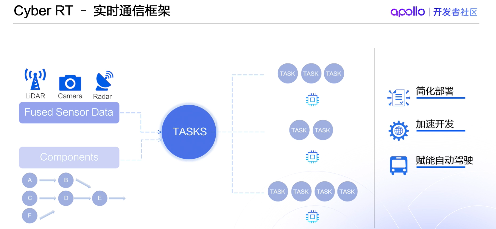
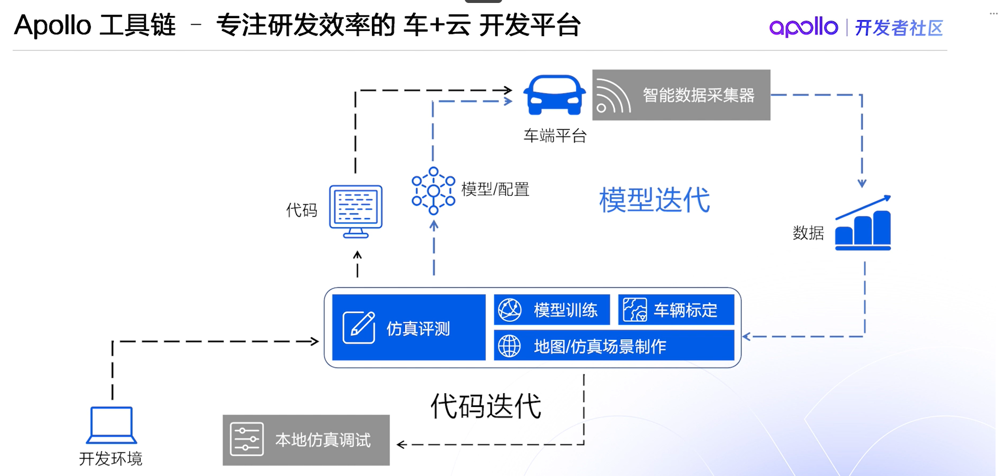
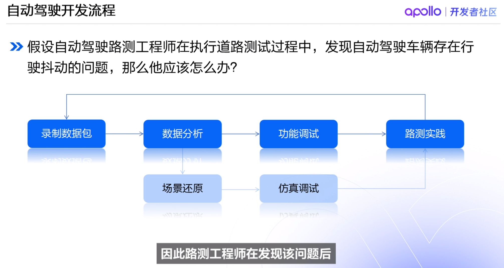
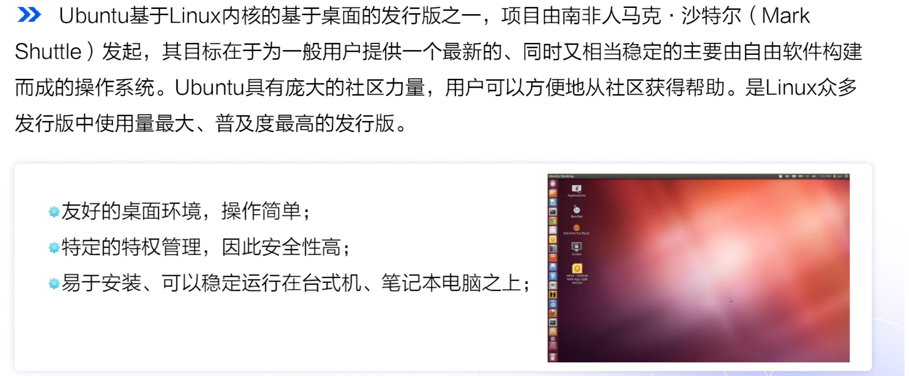
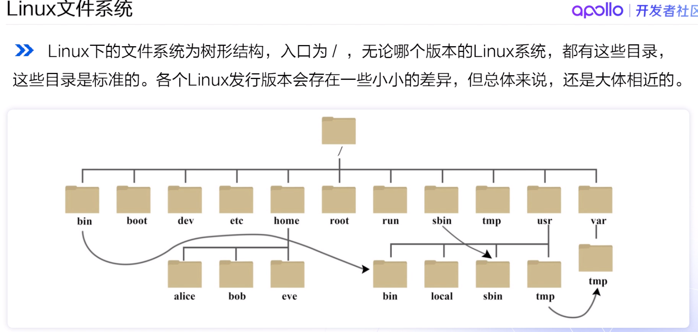
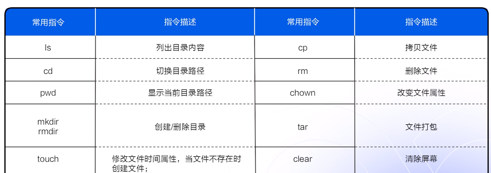
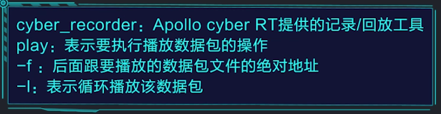
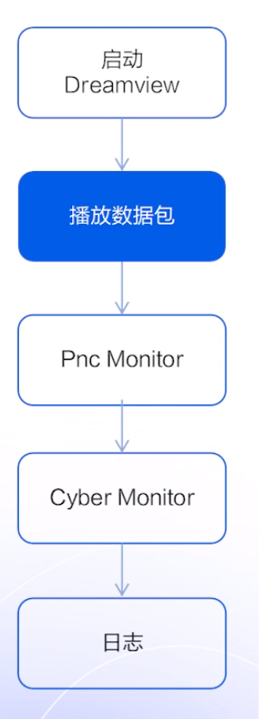

# Appolo 自主智能系统
## 1.3 开源平台详解
* Cyber RT实时通信框架： 将算法中的各个模块组织凝聚起来处理数据，同时保证在数据处理过程中的实时性和可靠性。
> 通过component来封装每个算法模块，通过有向无环图来描述每个算法之间的逻辑关系，对每个算法模块的优先级、运行时间、使用资源等配置。

> 协程：系统启动时候，调动DAG创建任务， 调度器将任务放在各个任务的队列之中，由tensor数据驱动任务的运转。

模型迭代 + 数据迭代
## 1.4 
* Cyber Monitor工具用来查看模块之间消息的通信。每一个消息由唯一的通道名channel来命名，FrameRatio也展示了消息的刷新频率。绿色的通道由信息更新，红色无。
* 上车硬件部署需要解决车辆闭环问题和集成验证问题。
* 
## 1.6 Ubuntu系统简介

* Vim具有三种模式：Command mode、Insert mode、Last line mode。
 打开vim 之后就进入了命令模式，该模式无法输入命令。
 i进入输入模式，左下方显示insert键。
 保存退出需要进入底线命令行模式。按下esc退出insert，再输入:q退出编辑，wq保存退出，q!不保存强制退出。
* 云平台支持在线编辑功能。
## 1.8 快速上手、五步入门自动驾驶（实验一）
Dreamview是Apollo提供的交互式软件

Pnc Monitor是Dreamview中内置的数据监视器，能够将规划、控制等部分的信息以图标的形式展示。
channel的信息可以用fn+上下键进行翻页
## 1.9 制作自动驾驶仿真场景
* 使用系统场景进行调试
* 使用编辑器编辑个人场景进行调试