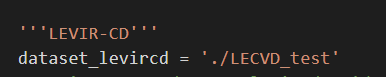
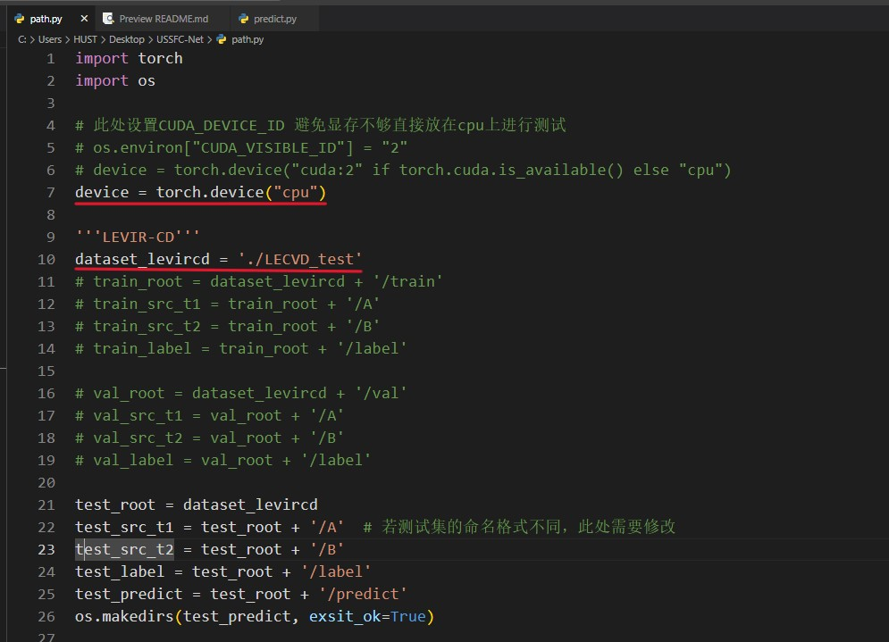

# 环境配置：
**所需要的包均在requirements.txt中**
对每个包的以及python版本没有特殊的要求。

**使用指南**
1、将测试集数据放在USSFC-Net文件夹中。
文件夹的树形结构例如：
test
|----A
|----B
|----Label
|----predict  # predict用于存放模型的测试结果
2、将path中的测试集根目录修改为第一步中放入的测试集文件夹的名称。
将path.py文件中的路径修改为自己的数据集路径,

3、由于担心显存限制，将device default设置为"cpu",如要修改，请在path.py的前部分进行修改。
4、测试请直接运行 predict python文件，即可输出四个指标，预测的图片存放在预测图像的文件夹predict下

所有需要修改的地方只有俩处，示例如下：

**注意**
* 要确保数据集的树形结构以及文件夹的命名，如果和上述不一致则需要修改文件名称为A、B、Label或者修改path中的子路径名称。
**contact**
如代码运行有问题，联系方式为：
qq: 1272773750